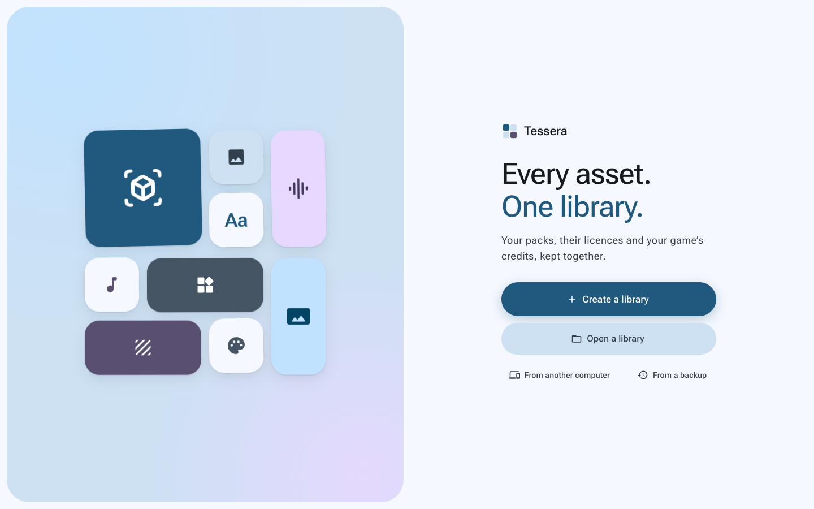
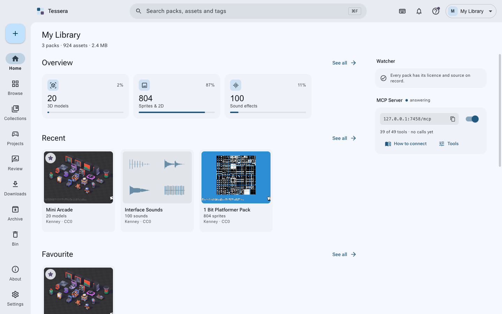
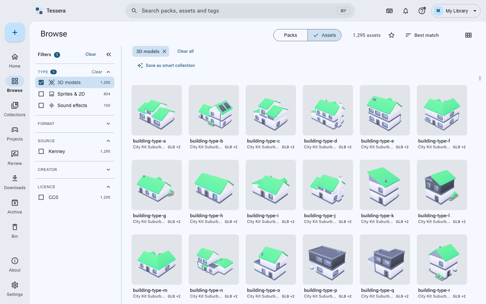
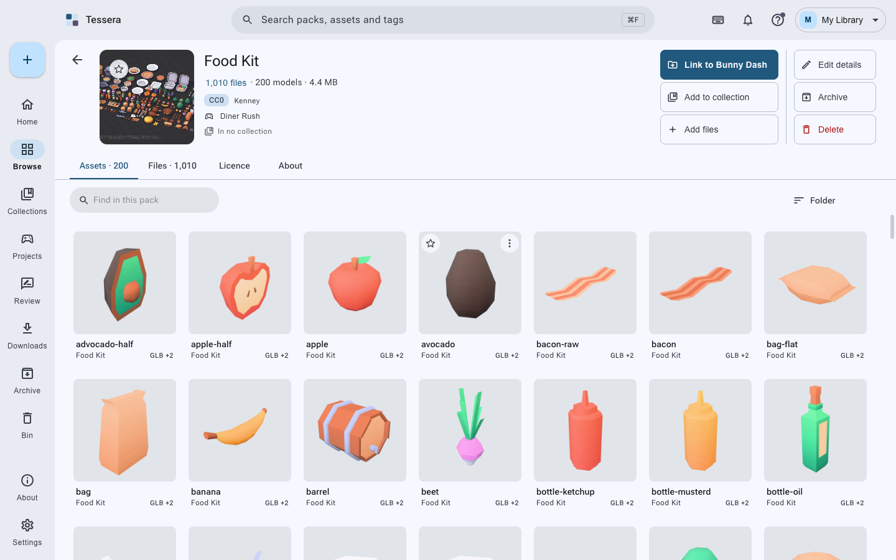
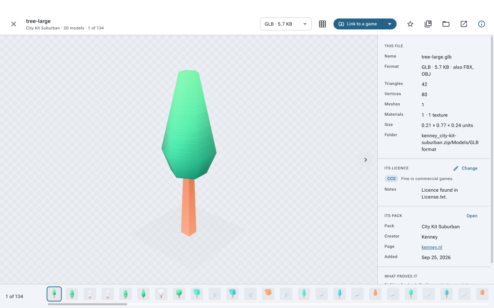
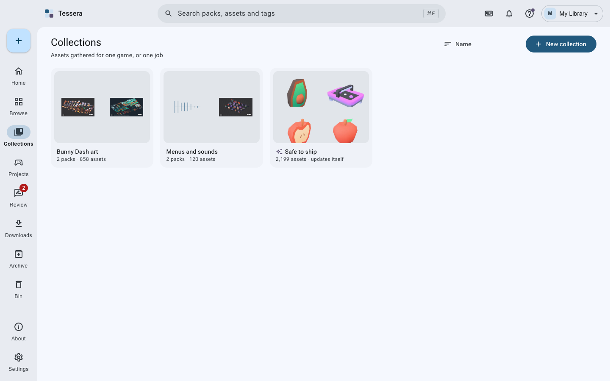
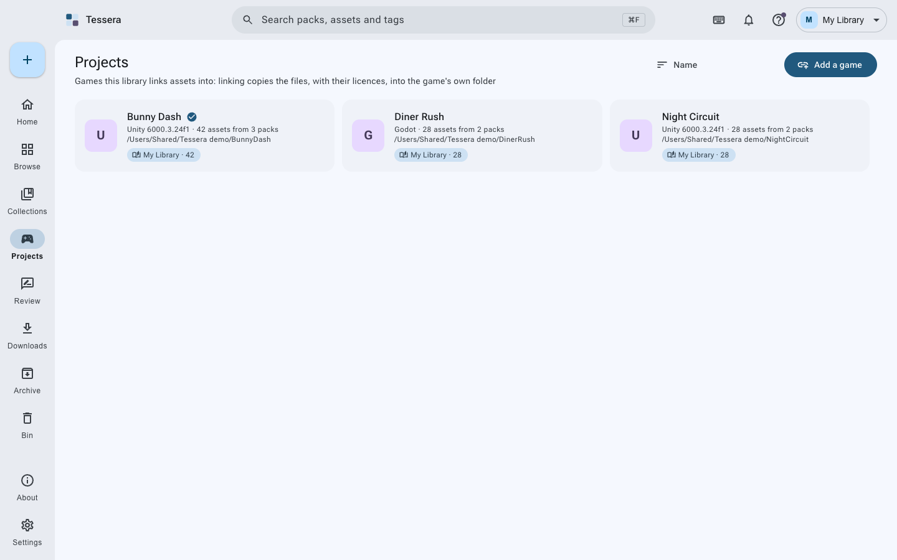
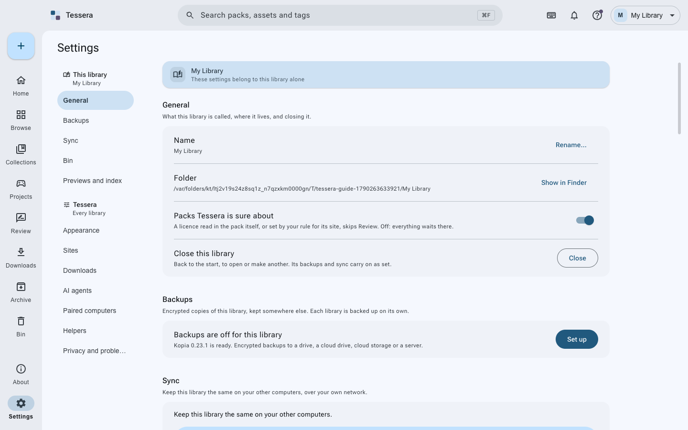
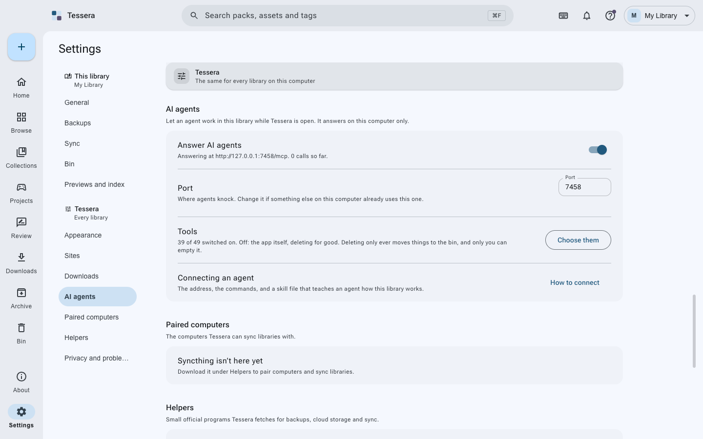
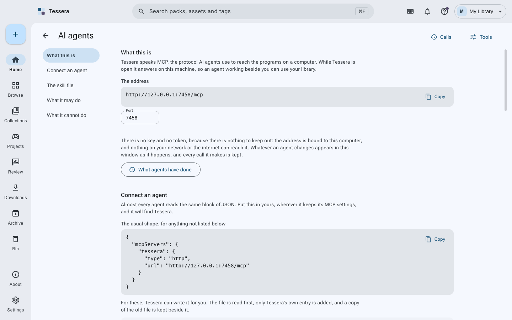

<div align="center">
  

<h3>A desktop library for game assets</h3>

  <p>
    Keep every pack you collect, with its licence and source on record. Find the piece you need in
    seconds, and copy it into your game with the credits written for you.
  </p>

[](https://github.com/ahmmedrejowan/tessera/releases)
[](LICENSE)
[](https://www.typescriptlang.org/)
[](https://www.electronjs.org/)
[](https://github.com/ahmmedrejowan/tessera/actions/workflows/ci.yml)

[tessera.rejowan.com](https://tessera.rejowan.com)
</div>

---

## Features

- **Packs kept whole** - your download is copied in as it came, zips included, and read inside for what it holds
- **Licence and source on record** - read from the pack's own files where possible, with a page snapshot kept as proof
- **Review** - anything without a licence or a source waits there, and cannot reach a game until it has both
- **Find anything** - search across packs, assets and tags, with filters by type, format, site, creator, licence, genre, style and tags
- **See it properly** - 3D models, images, HDRIs, sprites, sounds and fonts previewed in the app
- **Collections** - gather packs and files for one game, with rules that refuse what does not fit
- **Games** - link assets into Unity, Godot, Unreal or any folder, in the format that engine prefers, with a CREDITS.md kept up to date
- **Add to a pack later** - drop more files into a pack you already have, in the folder of your choosing
- **Starred, archived, binned** - keep what matters to hand, put the rest out of the way, and never lose anything to a mis-click
- **AI agents** - 49 tools over MCP, on this computer only, with what they may do in your hands
- **Backups and sync** - encrypted backups with Kopia, sync between your own computers with Syncthing, both optional
- **Yours, offline** - no accounts, no telemetry, no analytics. Your library is ordinary folders you can open at any time



---

## Download


[](https://github.com/ahmmedrejowan/tessera/releases)

| Your computer | Download |
|---------------|----------|
| macOS, Apple Silicon (M1 and newer) | [Tessera-arm64.dmg](https://github.com/ahmmedrejowan/tessera/releases/latest) |
| macOS, Intel | [Tessera-x64.dmg](https://github.com/ahmmedrejowan/tessera/releases/latest) |
| Windows 10 and 11 | [Tessera-Setup.exe](https://github.com/ahmmedrejowan/tessera/releases/latest) |
| Linux, portable | [Tessera.AppImage](https://github.com/ahmmedrejowan/tessera/releases/latest) |
| Debian and Ubuntu | [tessera.deb](https://github.com/ahmmedrejowan/tessera/releases/latest) |

Every file, with its checksum and what changed, is on the
[releases page](https://github.com/ahmmedrejowan/tessera/releases/latest).

These builds are not signed with a paid certificate, so each system asks once:

| System | What it says | What to do |
|--------|--------------|------------|
| macOS | "Tessera is damaged and can't be opened" | Right-click Tessera in Applications, choose **Open**, then **Open** again. Only the first time. |
| Windows | "Windows protected your PC" | Choose **More info**, then **Run anyway**. |
| Linux | nothing | `chmod +x Tessera-*.AppImage`, or `sudo dpkg -i tessera_*.deb`. |

Every release lists the SHA256 of each file, so you can check a download is the one that was built.

---

## Screenshots

| Home | Browse | A pack |
|------|--------|--------|
|  |  |  |

| The viewer | Collections | Games |
|------------|-------------|-------|
|  |  |  |

| Settings | AI agents | Connecting an agent |
|----------|-----------|---------------------|
|  |  |  |

---

## Using it

1. **Make a library.** The first screen asks where it should live. It is an ordinary folder: your
   packs go in `packs/`, one folder each, exactly as they were downloaded.
2. **Put something in it.** Drag a zip or a folder onto the window, use the + button, or paste a
   link into Downloads. Tessera reads the pack, including inside archives, and fills in what it can.
3. **Answer the licence question.** A pack with no licence or no source waits in Review until it
   has both. That is the whole point: it can never leave for a game unaccounted for.
4. **Find things.** Search across packs, files and tags, or narrow by kind, format, creator,
   licence, style. Double-click anything to see it properly.
5. **Gather.** A collection holds packs and files for one game, and can refuse anything that does
   not fit its rules.
6. **Link it into a game.** Tell Tessera where the game folder is; it copies the assets in, in the
   format that engine prefers, with a licence file beside them and CREDITS.md kept up to date.

Then, when you want it: [the step by step guide](docs/guide.md) with pictures, the
[questions people ask](docs/faq.md), and the [wiki](https://github.com/ahmmedrejowan/tessera/wiki).
The same words are in the app, under Help.

---

## Architecture

Three parts, and a contract between them:

```
src/
├── main/                      # Everything that touches the disk, the network or another program
│   ├── ipc/                   # One file per area; every channel of the contract is answered here
│   ├── index/                 # The SQLite index: files, classifying, queries, facets
│   ├── library/               # The library on disk: packs, layout, collections, the bin
│   ├── import/                # Planning and running an import
│   ├── downloads/             # The download queue and the sites it knows
│   ├── projects/              # Games: engines, copying in, credits, dependencies
│   ├── backup/                # Kopia, rclone, storage targets, the recovery kit
│   ├── sync/                  # Syncthing
│   ├── mcp/                   # The agent door: the server, its tools, the skill file
│   ├── thumbs/                # Previews, drawn in a hidden window
│   └── index.ts               # The composition root: builds the services, starts the app
│
├── preload/                   # The only bridge: window.tessera
│
├── renderer/                  # The window. It never touches a file itself
│   └── src/
│       ├── pages/             # One folder per place in the app
│       ├── components/        # The shared pieces every page is built from
│       ├── viewer/            # The full-screen file viewer
│       ├── state/             # Zustand stores and TanStack Query hooks
│       └── theme/             # Material 3 tokens, light and dark, from one seed colour
│
└── shared/                    # What both sides agree on
    ├── ipc.ts                 # The contract: every channel, typed
    ├── pack.ts                # What a pack is, and what its licence says
    ├── assets.ts              # Kinds, types, classifying
    └── licences.ts            # The licences Tessera knows
```

**How it fits together.** The window asks; the main process answers. Nothing in the renderer opens
a file, spawns a program or reaches the network: it calls a channel, and one handler in
`src/main/ipc` answers it. `index.ts` builds the services once and hands each group of handlers the
part of the app it needs, so a handler cannot reach for anything it was not given. A test reads the
contract and the handlers and fails if a channel is missing, answered twice, or answered without
being declared.

**The library is the truth.** The index holds nothing that is not in the library folder, so it can
be thrown away and built again at any time, and is, if it ever will not open.

### Tech stack

- **Shell**: Electron 44 with electron-vite, three processes (main, preload, renderer)
- **Language**: TypeScript, strict, with the IPC contract typed end to end
- **UI**: React 19, MUI 9, Material 3 tokens generated from one seed colour
- **State**: Zustand for what the window remembers, TanStack Query for what it asks for
- **Index**: `node:sqlite` with FTS5, one index per library
- **3D**: three.js, with a hidden window for thumbnails
- **Validation**: Zod 4, for settings, pack files and every agent tool
- **Agents**: Model Context Protocol over local HTTP
- **Tests**: Vitest, and Playwright driving the built app

---

## Requirements

- **Node**: 24 or newer, to build
- **Systems**: macOS 11+, Windows 10+, Linux with glibc 2.28 or newer
- Nothing else. Kopia, rclone and Syncthing are fetched only if you turn on backups or sync.

---

## Build and run

```bash
git clone https://github.com/ahmmedrejowan/tessera.git
cd tessera
npm install
npm run dev          # the app, with the window reloading as you save
npm run dist         # installers for this computer, in release/
```

## Testing

```bash
npm test             # the unit tests
npm run test:e2e     # end to end, against the built app
npm run typecheck    # both TypeScript projects
```

CI runs the typecheck, the tests and a packaged build on macOS, Windows and Linux for every push.

---

## Contributing

Contributions are welcome. [CONTRIBUTING.md](CONTRIBUTING.md) explains how the code is laid out and
what a change should look like; open an issue first if it is more than a small fix.

1. Fork the repository
2. Make your branch (`git checkout -b better-thing`)
3. `npm run typecheck && npm test`
4. Commit, push, and open a pull request

---

## Licence

```
Copyright (C) 2026 K M Rejowan Ahmmed

This program is free software: you can redistribute it and/or modify
it under the terms of the GNU General Public License as published by
the Free Software Foundation, either version 3 of the License, or
(at your option) any later version.

This program is distributed in the hope that it will be useful,
but WITHOUT ANY WARRANTY; without even the implied warranty of
MERCHANTABILITY or FITNESS FOR A PARTICULAR PURPOSE. See the
GNU General Public License for more details.
```

> **Note**
> This is a copyleft licence. Anything built on it stays free in the same way.

The separate programs Tessera can fetch (Kopia, rclone, Syncthing) keep their own licences, and so
do the assets you keep in your library.

---

## Community

- [Discussions](https://github.com/ahmmedrejowan/tessera/discussions) - ask anything, share what you have built
- [Issues](https://github.com/ahmmedrejowan/tessera/issues) - something wrong, or an idea
- [Releases](https://github.com/ahmmedrejowan/tessera/releases) - every version, with its notes
- [Security](SECURITY.md) - please email rather than opening an issue
- [Privacy](PRIVACY.md) - what stays here, and what leaves only when you ask
