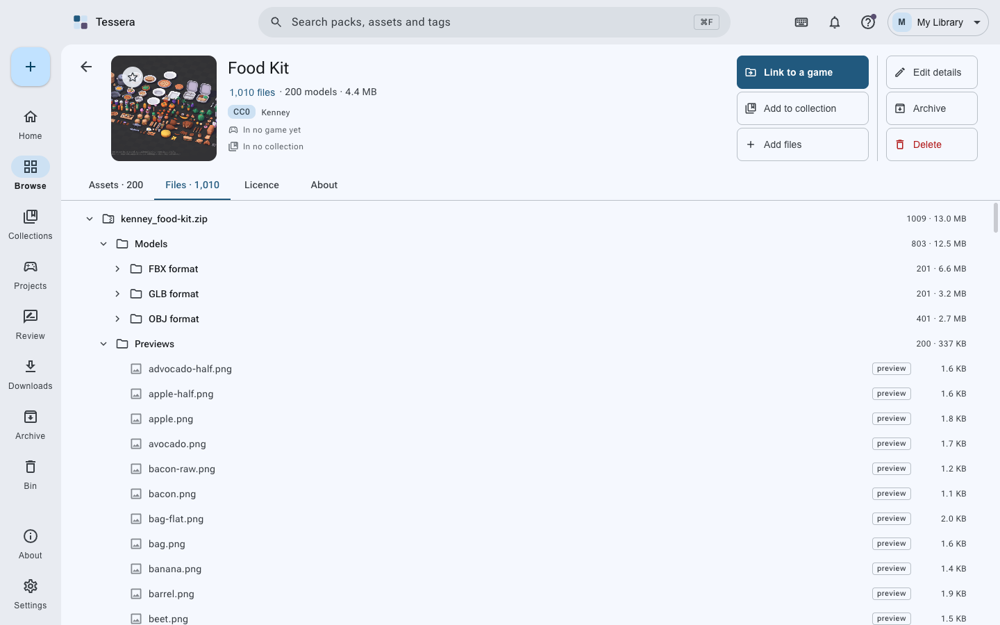

# Tessera, step by step

Everything in this guide is in the app too, under Help. Read it in order the first time; after
that, use the contents.

1. [Getting it](#getting-it)
2. [Starting out](#starting-out)
3. [Getting packs in](#getting-packs-in)
4. [Review, and why it exists](#review-and-why-it-exists)
5. [Finding things](#finding-things)
6. [Looking closely](#looking-closely)
7. [A pack's own page](#a-packs-own-page)
8. [Adding to a pack you already have](#adding-to-a-pack-you-already-have)
9. [Collections](#collections)
10. [Games](#games)
11. [Starred, the archive and the bin](#starred-the-archive-and-the-bin)
12. [Backups and sync](#backups-and-sync)
13. [AI agents](#ai-agents)
14. [Questions](#questions)

---

## Getting it

The shortest way, on a Mac or with Scoop on Windows, is a package manager:

| System | What to type |
|--------|--------------|
| macOS | `brew tap ahmmedrejowan/tessera && brew install --cask tessera` |
| Windows, Scoop | `scoop bucket add tessera https://github.com/ahmmedrejowan/scoop-tessera` then `scoop install tessera` |

Homebrew 7 asks before it loads anything from a tap that is not its own. If it does, run
`brew trust --cask ahmmedrejowan/tessera/tessera` and install again.

winget, Chocolatey and the AUR do not carry Tessera yet. Every release writes their manifests
already, so the day those accounts exist they will be published from the same build.

Or take the file for your computer from the
[releases page](https://github.com/ahmmedrejowan/tessera/releases/latest): a `.dmg` for macOS, an
`.exe` for Windows, an `.AppImage`, `.deb` or `.rpm` for Linux.

These builds are not notarised by Apple or signed with a Windows certificate, so each system asks
once the first time. On a Mac: press Done on the warning, then System Settings, Privacy & Security,
scroll to Security, and press Open Anyway. On Windows: More info, then Run anyway. Installing with
Homebrew skips all of this on a Mac.

---

## Starting out

The first time you open Tessera it asks where your library should live.

A library is an ordinary folder. Tessera makes `packs/` inside it and keeps every download as a
folder of its own, with a small `pack.json` beside it saying what the pack is and what its licence
says. You can open that folder in Finder or Explorer at any time; nothing is hidden in a database
you cannot read. The index Tessera builds for searching lives in its own data folder and can be
deleted at any time, because it is only ever a copy of what the folders say.

You can have as many libraries as you like. The switcher at the top right moves between them, and
each keeps its own settings, backups and sync.

Home is what the library is made of, what needs attention, and what you worked on last.

## Getting packs in

Four ways, and they all end in the same place:

- **Drag** a zip, a folder, or a handful of files onto the window.
- **The + button**, top left: choose files, a folder as one pack, or a folder of many packs.
- **Paste links** into Downloads. Tessera knows the asset pages of Kenney, Poly Haven, ambientCG,
  OpenGameArt, GitHub releases, Google Drive and Dropbox, and finds the file behind the page.
- **An AI agent**, if you have one connected. See [AI agents](#ai-agents).

Your download is copied in exactly as it came. A zip stays a zip; Tessera reads inside it and
lists what it holds, so you keep the original and still get a proper catalogue.

The add page opens with everything Tessera could work out already filled in: the name, the licence
if the pack carries one, where it came from, the creator, and a guess at kind and style. Change
what is wrong, then add. If you are adding several packs at once, fill a field in once and apply
it to all of them.

## Review, and why it exists

A pack with no licence on record, or nothing saying where it came from, waits in **Review**. It
is not in the library yet, it does not turn up in search, and nothing can be copied out of it into
a game.

That is on purpose. The whole point of Tessera is that the day someone asks what you shipped and
under what terms, the answer is in the app. A pack that skipped that question would be a hole in
it.

To move a pack out: open it in Review, set the licence and the source, and press the button that
appears. If you have already told Tessera that a site's packs are CC0 (Settings, Sites), packs
from that site skip Review by themselves.

## Finding things

Browse is everything in the library: files by default, packs if you prefer.

- The search box matches names, folders and the words a pack was filed under.
- The filters down the side narrow by kind, format, site, creator, licence, genre, style and tags.
  They stack, and each says how many things it would leave.
- Sorting is at the top right; starred things come first in every sort.
- ⌘F (Ctrl+F) from anywhere opens search.

Formats of one asset are grouped: a model that came as `.fbx`, `.obj` and `.glb` is one thing
with three formats, not three things.

## Looking closely

Double-click anything to open it. Models turn, images zoom, sounds play, fonts type.

The panel on the right says what the file is, which licence covers it, which pack it belongs to,
and what proves the licence. The strip along the bottom moves to the next file without leaving.
The background can be checkerboard, white or black, which matters when you are judging a sprite
with transparency.

## A pack's own page

The head of the page is the pack: its cover, what it holds, its licence and creator, the games and
collections it is in, and the six things you can do with it. The tabs below are its assets, every
file it holds, its licence in full, and everything else on record.

The Files tab shows the real folders, archives included. A file inside a zip is listed where it
lives, and can be previewed without unpacking anything.

## Adding to a pack you already have

A download that turned out to be missing a piece, or something you made that belongs with it:

- **Add files** on the pack's page, or
- **drag the files onto the pack's page**.

Either way an add page opens: choose where inside the pack they go (the top, a folder it already
has, or a new one), and say if they came under different terms from the rest of the pack. They are
copied in as they are, and the pack is read again.

## Collections

A collection is a gathering for one game or one job. It can hold single files and whole packs, and
a pack in a collection brings everything inside it.

- **Rules**: a collection can insist on, say, CC0 only, or refuse anything that needs a credit
  line. Something that does not fit is refused with the reason.
- **Tied to a game**: a collection can belong to a game, so linking knows where things go.
- **Saved searches**: a smart collection is a search that keeps itself up to date.

## Games

Tell Tessera where a game folder is and it works out the engine: Unity, Godot, Unreal, or any
folder.

**Link to a game** copies the assets in, in the format that engine prefers, with their textures,
a licence file beside each pack, and a `CREDITS.md` kept up to date. It is a copy, not a link in
the filesystem sense: the game folder stands on its own, so you can hand it to someone else or
build it on another machine.

The game's page lists everything it has taken, which pack each came from, and under what licence.
You can take assets back out, and the credits are updated.

## Starred, the archive and the bin

- **Star** anything worth coming back to. Starred things come first in every sort, and Home has a
  row of them.
- **Archive** a pack you want to keep but not see: it stays whole, out of browsing, and the games
  that already use it are unaffected.
- **Delete** puts things in the library's **bin**, inside the library folder. They wait there
  until you empty it, or the time you set runs out, and go back to exactly the pack and folder
  they came from.

## Backups and sync

Both are optional, and both are other people's programs that Tessera fetches only if you ask.

- **Backups** use Kopia: encrypted with your own password before anything leaves, to a folder, a
  drive, a server over SSH, S3-compatible storage, or a cloud drive. Restore is in the app, into
  a fresh folder.
- **Sync** uses Syncthing: directly between computers you have paired, over your own network, with
  no middle server.

Keep the backup password somewhere safe. Without it a backup is a pile of noise, and nobody, me
included, can open it for you.

## AI agents

While Tessera is open it answers AI agents on your own computer, so an agent working beside you
can use the library: search it, record a licence, gather a collection, link assets into a game.

The page under Home, AI agents, has the address, the block of settings almost every agent takes,
and a button that writes Tessera into Claude Code, Claude Desktop, Cursor, VS Code or Windsurf for
you.

You choose what an agent may do, by what it does: looking, filing, linking to a game, bringing
things in, deleting to the bin. Two more groups start switched off, marked in red: the app itself
(libraries and settings) and deleting for good. Every call an agent makes is listed, and everything
it changes is written into Activity.

Nothing outside this computer can reach it, and nor can a web page.

## Questions

The [questions people ask](faq.md) covers the ones that come up most: where files go, what happens
if you move the folder, what Tessera sends anywhere, and what to do when something looks wrong.
